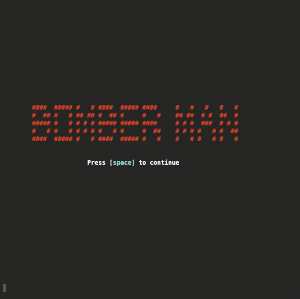
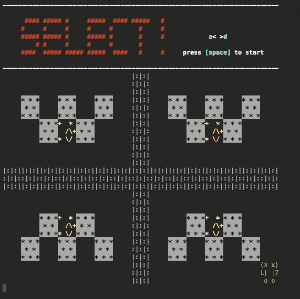
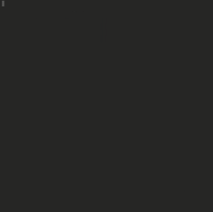
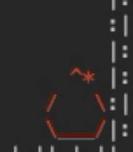
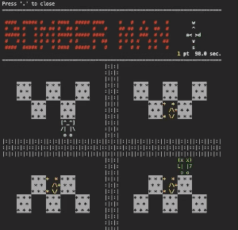
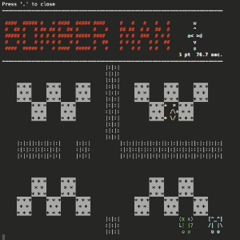
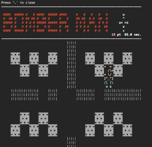

# [week7_1](https://eeic-software1.github.io/2021/week7/#week7_1)


以下、課題8についてです。課題8に到達しなかった場合は、編集しなくて大丈夫です。

## 課題8について
もし優秀賞に選ばれた場合、ユーザ名とコードをソフ１メンバーに公開してもいいですか？（***はい***・~~いいえ~~）


複数人で課題を行った場合、一緒に行ったユーザの名前を書いてください。また、メインリポジトリのユーザ名を書いてください。
- 一緒に行ったユーザ名（複数可）：
- メインリポジトリのユーザ名：


## 課題8のコンパイルと実行

実行するために必要なコマンド（必要に応じて編集してください）

コンパイル：
```bash
gcc main2.c -o main2
```

実行：
```
./main2
```

## 課題8の解説
### 新たに実装した機能
* 爆弾を複数個置けるようにする
* 爆弾の連鎖
* 爆発を時間制に
* 壊せる壁
* 時間制限
* 宝を集める要素
* 宝をとると爆弾を置ける個数が増える+点数が増える
* 敵キャラ
* 見た目をリッチに
* 盤面の選択
* フィールドを長方形に拡張

### 遊び方
#### タイトル
  
スペースキーを押すと始まります。
文字がチカチカしているのが*推しポイント*です。  
#### 盤面選択
  
a< >dで盤面を選びます。スペースキーを押すと、選択した盤面でゲームが始まります。  
#### カウントダウン
  
3カウントの後ゲームが始まります。  
#### 爆発
  
爆発の前、爆弾が1秒ごとに点滅します。最後の1秒間は光り続けます。(*推しポイント*)

#### 爆発に巻き込まれると死ぬ
  
爆発に巻き込まれると死んでゲームオーバーになります。爆弾の炎が他の爆弾に当たると連鎖が起こって盤面上にある全ての爆弾が爆発します。調子に乗って爆弾を置きすぎると自滅します。  

#### 爆弾で敵を倒す
  
敵は爆弾を避ける道を選びつつも、ある程度はランダムに動きます。障害物や角を利用して敵を追い込み、爆弾で倒しましょう。敵を倒すと10ポイントが加算されます。

#### クリア
  
宝物を全てあつめて敵を倒すとクリアです。   
時間内に宝物を集めきらないor敵を倒せない場合にはゲームオーバーとなります。残り時間を気にしながらゲームを進めましょう。残り時間が10秒以下になると時間表示が赤色になります。(*推しポイント*)  


### 敵の挙動について
敵は0.3秒に一回、以下のルールに従って動きます。
1. 爆弾が接している時は、その方向と反対に移動する  
今いる位置の左隣が爆弾なら、強制的に右に進みます。

2. 上下左右、停滞をランダム  
隣に爆弾がなかった場合や、あってもその反対方向が障害物等で塞がっていた場合には、上:下:左:右:停滞=2:2:2:2:1になる様にランダムに動きます。

3. 障害物や境界の方向には進まない  
上記の様にランダムに決定された方向に障害物等がある場合には、もう一度ランダムで進む方向を決定します。例えば、今いる位置の上と下が塞がっている場合には、ランダムで上下が出た場合は強制的にやり直しとなるので、左:右:停滞=2:2:1でランダムに動きます。

4. 2個先に爆弾が見えているときにはその方向には進まない  
たとえば、ランダムの結果が左だとして、今いる場所の2個左が爆弾だったときにはやり直しになります。敵は前しか見えないので、進む先のマスが爆弾と隣合っていたとしてもその爆弾が進む方向と同じ方向でなければ感知することはできません。先の例では、斜め左(左の上)が爆弾でも、敵は左に進みます。

### kbhit()関数について
`getchar()`は入力がないと画面が止まってしまうので、残り時間を更新し続けるために、キーボードが打たれたかを判定する`kbhit()`を導入し、キーボードが打たれた時のみ`getchar()`をすることで対応しました。  
`kbhit()`の実装は[このサイト](https://hotnews8.net/programming/tricky-code/c-code03)のコードを使いました。
